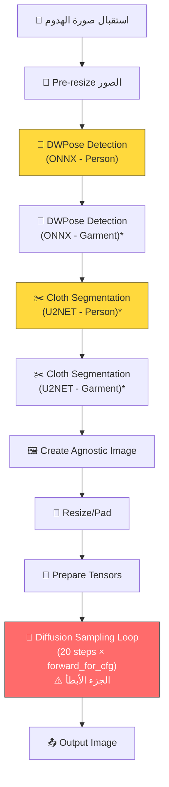

# 🚀 بحث شامل: تسريع FASHN VTON 1.5 على الـ CPU

## فهم المشكلة أولاً

بعد مراجعة الكود كامل، الـ Pipeline بتاعتكم بتعمل الآتي في كل request:



> [!IMPORTANT]
> **الـ Bottleneck الرئيسي:** الـ Diffusion Sampling Loop ([`_sample`](file:///run/media/bayoumi/02CA14DDCA14CF33/fashn-vton-1.5/src/fashn_vton/pipeline.py#L157-L214)) بتنادي `forward_for_cfg` **20 مرة** (عدد الـ timesteps)، وكل مرة بتعمل **forward pass مرتين** (conditional + unconditional) لأنها بتضاعف الـ batch عشان الـ CFG. يعني إجمالي **40 forward pass** كاملة للـ MMDiT model!

---

## 📊 ملخص الحلول - نظرة سريعة

| # | الحل | التأثير المتوقع | صعوبة التنفيذ | يحتاج تغيير كود؟ |
|---|------|----------------|--------------|-----------------|
| 1 | ⭐ **Caching الـ Preprocessing للمودلز الثابتة** | 🟢 توفير 20-40% من الوقت | سهل | نعم |
| 2 | ⭐ **تقليل عدد الـ Timesteps** | 🟢 توفير 25-50% | سهل جداً | لا (parameter) |
| 3 | ⭐ **`torch.compile()` للـ TryOnModel** | 🟢 تسريع 1.5-3x | متوسط | نعم (سطر واحد) |
| 4 | **Quantization (INT8/Dynamic)** | 🟢 تسريع 2-4x | متوسط | نعم |
| 5 | **تحويل لـ ONNX Runtime** | 🟢 تسريع 2-3x | صعب | نعم (كبير) |
| 6 | **تحويل لـ OpenVINO** | 🟢🟢 تسريع 3-5x | صعب | نعم (كبير) |
| 7 | **Token Merging (ToMe)** | 🟡 تسريع 1.3-2x | متوسط | نعم |
| 8 | **Channels Last Memory Format** | 🟡 تسريع 1.1-1.5x | سهل | نعم (سطر واحد) |
| 9 | **Threading & Memory Allocator** | 🟡 تسريع 1.1-1.3x | سهل | لا (env vars) |
| 10 | **تقليل الـ Input Resolution** | 🟡 تسريع كبير | سهل | نعم |
| 11 | **Skip CFG في أكتر خطوات** | 🟡 توفير 10-30% | سهل | نعم |
| 12 | **DeepCache / Block Caching** | 🟡 تسريع 1.5-2x | صعب | نعم |

---

## 📋 تفاصيل كل حل

---

### ⭐ الحل 1: Caching الـ Preprocessing للمودلز الثابتة (الأهم بالنسبالكم!)

> [!TIP]
> **ده الحل الأنسب ليكم تماماً!** إنتو قلتوا إن المودلز (الأشخاص) ثابتين واللي بيتغير بس الهدوم. ده معناه إننا نقدر نحسب حاجات كتير مرة واحدة بس!

#### إيه اللي ممكن نعمله cache؟

بالنظر للكود في [`pipeline.py`](file:///run/media/bayoumi/02CA14DDCA14CF33/fashn-vton-1.5/src/fashn_vton/pipeline.py):

**لكل person model ثابت، ممكن نحسب مرة واحدة ونحفظ:**

1. **`person_pose`** — نتيجة الـ DWPose detection (lines 266)
   - الـ DWPose بتشتغل بـ ONNX Runtime وبتاخد وقت
   - ممكن نحفظ الـ keypoints والـ scores كـ `.npz` file

2. **`person_pose_img`** — الصورة المرسومة للـ pose (line 273)
   - ممكن نحفظها كـ numpy array

3. **`person_seg_pred`** — نتيجة الـ cloth segmentation (lines 278-282)
   - لو `segmentation_free=True` (اللي هو الـ default عندكم)، ده أصلاً بيرجع zeros
   - لو مش segmentation_free، الـ U2NET بتاخد وقت وممكن نحفظ النتيجة

4. **`ca_image`** — الـ clothing-agnostic image (lines 296-303)
   - ممكن نحفظها

5. **`ca_tensor`** — التنسور النهائي بعد الـ resize/pad/normalize (line 325)
   - ده الأحسن - نحفظ التنسور جاهز مباشرة

6. **`person_pose_tensor`** — (line 327)
   - نفس الكلام

#### إيه اللي **مش** ممكن نعمله cache؟
- الـ garment image preprocessing (لأنها بتتغير كل مرة)
- الـ Diffusion sampling loop (لأن الـ garment input بيتغير)

#### التوفير المتوقع:
- الـ DWPose detection: ~2-5 ثواني على CPU
- الـ U2NET segmentation: ~3-8 ثواني على CPU
- الـ preprocessing (resize, pad, normalize): ~1-2 ثانية
- **إجمالي: ~6-15 ثانية توفير لكل request**

#### طريقة التنفيذ:
```python
# في models_registry.py أو ملف جديد
import json, numpy as np, torch

PRECOMPUTED_DIR = "weights/precomputed"

def precompute_model_data(model_id, pipeline):
    """حساب كل البيانات الثابتة للمودل مرة واحدة"""
    person_image = load_model_image(model_id)
    
    # Pose detection
    person_pose = pipeline.pose_model(person_image_np[..., ::-1])
    person_pose_img = draw_pose(person_pose, ...)
    
    # Segmentation (لو مش segmentation_free)
    person_seg_pred = pipeline.cloth_segmenter.predict(person_image_np)
    
    # Save everything
    np.savez(f"{PRECOMPUTED_DIR}/{model_id}.npz",
             pose_keypoints=person_pose[0],
             pose_scores=person_pose[1],
             pose_img=person_pose_img,
             seg_pred=person_seg_pred)

def load_precomputed(model_id):
    """تحميل البيانات المحسوبة مسبقاً"""
    data = np.load(f"{PRECOMPUTED_DIR}/{model_id}.npz")
    return data
```

> [!NOTE]
> ممكن كمان نحفظ الـ tensors النهائية (`ca_tensor`, `person_pose_tensor`) كـ `.pt` files عشان نتجنب حتى خطوات الـ resize والـ normalization. بس لازم ناخد بالنا إن الـ tensors دي بتعتمد على الـ `category` (tops/bottoms/one-pieces) لأن الـ clothing-agnostic image بتتغير حسب الـ category.

---

### ⭐ الحل 2: تقليل عدد الـ Timesteps

#### الوضع الحالي:
- في [`main.py`](file:///run/media/bayoumi/02CA14DDCA14CF33/fashn-vton-1.5/api/main.py#L371): `num_timesteps: int = Form(default=20, ge=10, le=50)`
- يعني الـ default هو 20 step، وكل step = 2 forward passes (CFG)

#### الفكرة:
- جربوا **10-15 steps** بدل 20
- كل step بتوفروها = توفير ~5% من وقت الـ sampling
- **من 20 لـ 10 = توفير 50% من وقت الـ sampling!**

#### المخاطر:
- الجودة ممكن تقل شوية
- لازم تجربوا وتقارنوا النتائج بعينكم

#### ملاحظة مهمة:
الـ API عندكم أصلاً بتقبل `num_timesteps` كـ parameter، فمش محتاجين تغيروا كود - بس ابعتوا `num_timesteps=10` أو `num_timesteps=15` من الـ Flutter app.

---

### ⭐ الحل 3: `torch.compile()` للـ TryOnModel

#### الفكرة:
`torch.compile()` في PyTorch 2.0+ بتحول الـ model لـ optimized graph بيستخدم kernel fusion وبيقلل الـ Python overhead.

#### طريقة التنفيذ:
```python
# في pipeline.py بعد تحميل المودل
def _setup_tryon_model(self):
    # ... الكود الموجود ...
    self.tryon_model.to(self.device, dtype=self.inference_dtype).eval()
    
    # ✨ إضافة torch.compile
    if self.device.type == "cpu":
        self.tryon_model = torch.compile(
            self.tryon_model, 
            mode="reduce-overhead",  # أو "default"
            backend="inductor",
        )
```

#### مميزات:
- **سطر واحد** بس!
- الـ Inductor backend بيعمل operator fusion (مثلاً Conv+ReLU في operation واحدة)
- بيستخدم oneDNN/MKL-DNN للـ optimized kernels على CPU
- تسريع متوقع: **1.5-3x** على CPU

#### عيوب:
- أول run بتاخد وقت طويل (compilation) - ممكن دقائق
- بعد كده كل الـ runs بتكون سريعة
- ممكن يحصل "graph breaks" بسبب بعض الـ operations (زي الـ `einops.rearrange`)
- لازم تتأكدوا إن مفيش errors

#### نصيحة:
جربوا `mode="default"` الأول لو `"reduce-overhead"` عملت مشاكل. وكمان جربوا `fullgraph=True` عشان تعرفوا لو في graph breaks:
```python
self.tryon_model = torch.compile(self.tryon_model, fullgraph=True)  # هيعمل error لو في graph break
```

---

### الحل 4: Quantization (INT8 / Dynamic Quantization)

#### الفكرة:
تحويل الـ model من FP32 لـ INT8 بيقلل حجم العمليات الحسابية ويخلي الـ CPU يعمل العمليات أسرع.

#### خيار A: Dynamic Quantization (الأسهل)
```python
import torch.ao.quantization as quant

# بعد تحميل المودل
model = quant.quantize_dynamic(
    self.tryon_model,
    {torch.nn.Linear},  # quantize Linear layers only
    dtype=torch.qint8
)
```

**مميزات:** سهل جداً - سطر واحد  
**عيوب:** بيعمل quantize للـ Linear layers بس، ممكن الجودة تتأثر شوية

#### خيار B: Static Quantization (أصعب بس أفضل)
- محتاج calibration data
- بيعمل quantize لكل الـ layers
- نتائج أحسن من Dynamic

#### خيار C: Post-Training Quantization مع ONNX Runtime
```python
from onnxruntime.quantization import quantize_dynamic, QuantType

quantize_dynamic(
    "model.onnx",
    "model_quantized.onnx", 
    weight_type=QuantType.QInt8
)
```

#### التأثير المتوقع:
- **Dynamic Quantization:** تسريع 1.5-2x
- **Static Quantization:** تسريع 2-4x
- **مع فقدان جودة محتمل** (لازم تجربوا)

> [!WARNING]
> الـ Quantization ممكن يأثر على جودة الصور المُنتجة. لازم تقارنوا النتائج قبل وبعد بعناية. الـ MMDiT architecture فيها attention layers حساسة للـ precision.

---

### الحل 5: تحويل لـ ONNX Runtime

#### الفكرة:
بدل PyTorch، نحول الـ TryOnModel لـ ONNX format ونشغلها بـ ONNX Runtime اللي عنده optimizations خاصة للـ CPU.

#### الخطوات:
```python
# 1. Export to ONNX
import torch

dummy_inputs = create_dummy_inputs()  # لازم تعملوا dummy inputs بنفس الشكل
torch.onnx.export(
    tryon_model,
    dummy_inputs,
    "tryon_model.onnx",
    opset_version=17,
    dynamic_axes={...}
)

# 2. Optimize the ONNX model
from onnxruntime.transformers import optimizer
optimized = optimizer.optimize_model("tryon_model.onnx")
optimized.save_model_to_file("tryon_model_optimized.onnx")

# 3. Run with ONNX Runtime
import onnxruntime as ort

session_options = ort.SessionOptions()
session_options.graph_optimization_level = ort.GraphOptimizationLevel.ORT_ENABLE_ALL
session_options.intra_op_num_threads = os.cpu_count()

session = ort.InferenceSession(
    "tryon_model_optimized.onnx",
    sess_options=session_options,
    providers=["CPUExecutionProvider"]
)
```

#### مميزات:
- الـ DWPose أصلاً شغال بـ ONNX Runtime! ([wholebody.py](file:///run/media/bayoumi/02CA14DDCA14CF33/fashn-vton-1.5/src/fashn_vton/dwpose/wholebody.py))
- ONNX Runtime بيعمل graph-level optimizations: operator fusion, constant folding
- **Transformer-specific optimizations:** Multi-Head Attention fusion

#### عيوب:
- الـ export ممكن يكون صعب بسبب الـ dynamic shapes والـ custom operations
- الـ `einops.rearrange` وبعض الـ operations ممكن متكونش supported
- محتاج تغيير كبير في الـ inference loop
- الـ `forward_for_cfg` بتعمل tensor duplication وده ممكن يعقد الـ export

#### التأثير المتوقع:
- تسريع **2-3x** مقارنة بـ PyTorch eager mode

---

### الحل 6: تحويل لـ OpenVINO (الأقوى للـ Intel CPUs)

#### الفكرة:
OpenVINO من Intel هو أفضل خيار لتشغيل models على Intel CPUs. بيعمل optimizations متقدمة جداً.

#### الخطوات:
```bash
pip install openvino optimum[openvino]
```

```python
from openvino import Core
import openvino as ov

# 1. Convert PyTorch model to OpenVINO IR
# الطريقة 1: من PyTorch مباشرة
ov_model = ov.convert_model(tryon_model, example_input=dummy_inputs)
ov.save_model(ov_model, "tryon_model.xml")

# الطريقة 2: من ONNX
ov_model = ov.convert_model("tryon_model.onnx")

# 2. Compile with optimizations
core = Core()
compiled_model = core.compile_model(
    ov_model, 
    "CPU",
    config={
        "PERFORMANCE_HINT": "LATENCY",
        "INFERENCE_NUM_THREADS": str(os.cpu_count()),
    }
)

# 3. Run inference
result = compiled_model(inputs)
```

#### مميزات:
- **أفضل أداء على Intel CPUs** (يدعم AMX, AVX-512, VNNI)
- يدعم INT8/INT4 quantization مدمجة
- Graph-level optimizations متقدمة
- Layer fusion أحسن من ONNX Runtime

#### عيوب:
- **يعمل بس على Intel CPUs** (لو عندكم AMD، مش هينفع)
- نفس مشاكل الـ ONNX export (dynamic shapes, custom ops)
- محتاج تغيير كبير في الكود

#### التأثير المتوقع:
- تسريع **3-5x** على Intel CPUs

> [!NOTE]
> لو البروسيسور بتاعكم Intel، ده هيكون أقوى حل. لو AMD، روحوا على ONNX Runtime أو PyTorch compile.

---

### الحل 7: Token Merging (ToMe)

#### الفكرة:
الـ TryOnModel عندكم هو MMDiT (Multi-Modal Diffusion Transformer) - شبيه بـ FLUX. الـ attention بتعمل على tokens كتير (الصورة 864×576 مع patch_size=12 = 72×48 = **3,456 token**). Token Merging بيدمج الـ tokens المتشابهة عشان يقلل عدد العمليات.

#### كيف يعمل:
```python
# في كل attention layer، قبل ما نحسب الـ attention:
# 1. نحسب similarity بين الـ tokens
# 2. ندمج الـ tokens المتشابهة
# 3. نعمل attention على عدد أقل من tokens
# 4. نفك الدمج بعد الـ attention
```

بالنظر للـ architecture في [`tryon_mmdit.py`](file:///run/media/bayoumi/02CA14DDCA14CF33/fashn-vton-1.5/src/fashn_vton/tryon_mmdit.py):
- 8 DoubleStreamBlocks + 16 SingleStreamBlocks = **24 block** كل واحد فيه attention
- كل attention بتعمل على **3,456 × 2 = 6,912 tokens** (person + garment)
- الـ complexity هي O(n²) يعني **~47 مليون** عملية في كل attention layer!

#### التأثير المتوقع:
- بنسبة merge 20%: تسريع ~1.3x
- بنسبة merge 50%: تسريع ~2x (بس الجودة هتتأثر)

#### العيوب:
- محتاج تعديل في كل attention block
- ممكن يأثر على الجودة
- Implementation مش trivial للـ MMDiT architecture لأنها dual-stream

---

### الحل 8: Channels Last Memory Format

#### الفكرة:
تغيير الـ memory layout للـ tensors من `NCHW` (الـ default) لـ `NHWC` (channels last). ده بيحسن الـ cache locality على CPU ويسرع الـ convolution operations.

#### التنفيذ:
```python
# في _setup_tryon_model
self.tryon_model = self.tryon_model.to(memory_format=torch.channels_last)

# وفي الـ input tensors
ca_tensor = ca_tensor.to(memory_format=torch.channels_last)
garment_tensor = garment_tensor.to(memory_format=torch.channels_last)
```

#### مميزات:
- سهل جداً
- مفيش تأثير على الجودة
- بيفيد أكتر مع الـ Conv2d layers (الـ PatchEmbed عندكم فيها Conv2d)

#### عيوب:
- التأثير محدود لأن معظم المودل transformer-based (Linear layers)
- الـ Conv2d موجودة بس في الـ PatchEmbed

#### التأثير المتوقع:
- تسريع **1.1-1.5x** (محدود)

---

### الحل 9: Threading & Memory Allocator Tuning

#### الفكرة:
ضبط الـ environment variables عشان PyTorch يستخدم الـ CPU threads بكفاءة أكتر.

#### التنفيذ:
```bash
# قبل ما تشغلوا الـ server
export OMP_NUM_THREADS=$(nproc)
export MKL_NUM_THREADS=$(nproc)
export TORCH_NUM_THREADS=$(nproc)

# استخدام jemalloc بدل الـ default allocator
# لو على Ubuntu:
sudo apt install libjemalloc-dev
export LD_PRELOAD=/usr/lib/x86_64-linux-gnu/libjemalloc.so

# أو tcmalloc
sudo apt install libgoogle-perftools-dev
export LD_PRELOAD=/usr/lib/x86_64-linux-gnu/libtcmalloc.so

# تشغيل الـ server
uvicorn api.main:app --host 0.0.0.0 --port 8000
```

#### مميزات:
- **مفيش أي تغيير في الكود!**
- سهل التجربة

#### التأثير المتوقع:
- تسريع **1.1-1.3x**

---

### الحل 10: تقليل الـ Input Resolution

#### الفكرة:
الـ model حالياً input shape هو **(864, 576)** ([tryon_mmdit.py L370](file:///run/media/bayoumi/02CA14DDCA14CF33/fashn-vton-1.5/src/fashn_vton/tryon_mmdit.py#L370)). تقليل الـ resolution بيقلل عدد الـ tokens بشكل كبير.

#### المشكلة:
- الـ model مُدرَّب على 864×576
- تغيير الـ input shape هيحتاج **إعادة تدريب** أو fine-tuning
- **مش عملي** إلا لو عندكم القدرة على التدريب

#### بديل:
- ممكن تعملوا inference على resolution أقل وبعدين upscale بـ super-resolution model خفيف

---

### الحل 11: Skip CFG في خطوات أكتر

#### الوضع الحالي:
في [`_sample`](file:///run/media/bayoumi/02CA14DDCA14CF33/fashn-vton-1.5/src/fashn_vton/pipeline.py#L157-L214)، الـ CFG (Classifier-Free Guidance) بتعمل **forward pass مرتين** في كل step - مرة conditional ومرة unconditional. الكود بيعمل skip للـ CFG في آخر step بس (`skip_cfg_last_n_steps=1`).

#### الفكرة:
```python
# بدل ما نعمل CFG في كل الـ 20 steps:
# ممكن نعمل CFG كل خطوتين (alternating)
# أو نعمل skip في آخر 3-5 steps بدل 1

# في الـ API
result = pipeline(
    ...,
    skip_cfg_last_n_steps=5,  # بدل 1
)
```

#### أو بنهج أكتر تقدماً:
```python
# في _sample method:
# نعمل CFG في أول نص الخطوات بس
if step_idx < num_timesteps // 2:
    v_guided = v_u + guidance_scale * (v_c - v_u)
else:
    v_guided = v_c  # conditional بس - forward pass واحد
```

#### التأثير:
- `skip_cfg_last_n_steps=5` مع 20 steps: توفير **25%** من وقت الـ sampling
- `skip_cfg_last_n_steps=10`: توفير **50%** بس الجودة هتتأثر

---

### الحل 12: DeepCache / Block Caching

#### الفكرة:
في الـ diffusion sampling، الـ intermediate features بين الـ steps المتتالية بتكون متشابهة جداً. بدل ما نحسب كل الـ 24 blocks في كل step، ممكن نعمل cache لبعض الـ blocks ونعيد استخدامها.

#### كيف يعمل:
```python
# في الـ sampling loop:
# Step 1: شغل كل الـ 24 blocks → احفظ outputs الـ blocks الثقيلة
# Step 2: شغل بس الـ blocks الخفيفة + استخدم cached outputs
# Step 3: شغل كل الـ blocks (refresh)
# Step 4: شغل بس الـ blocks الخفيفة + cached
# ... وهكذا بالتناوب
```

#### التأثير المتوقع:
- تسريع **1.5-2x** مع فقدان جودة طفيف

#### العيوب:
- Implementation معقد جداً
- محتاج دراسة عميقة للـ architecture عشان نعرف أي blocks ممكن نعملها cache

---

## 🏆 الاستراتيجية المقترحة (ترتيب التنفيذ)


### المرحلة 1: Quick Wins (يوم - يومين)

| الترتيب | الحل | التأثير |
|---------|------|---------|
| 1 | **Caching الـ Preprocessing** (الحل 1) | توفير 20-40% |
| 2 | **تقليل الـ timesteps لـ 15 أو 10** (الحل 2) | توفير 25-50% |
| 3 | **Threading tuning** (الحل 9) | تسريع 1.1-1.3x |
| 4 | **Channels Last** (الحل 8) | تسريع 1.1-1.5x |
| 5 | **زيادة `skip_cfg_last_n_steps`** (الحل 11) | توفير 10-25% |

> [!IMPORTANT]
> **المرحلة 1 لوحدها ممكن تقلل الوقت بنسبة 50-70%!**
> يعني لو كان 10 دقائق، ممكن ينزل لـ 3-5 دقائق.

### المرحلة 2: Medium Effort (3-5 أيام)

| الترتيب | الحل | التأثير |
|---------|------|---------|
| 6 | **`torch.compile()`** (الحل 3) | تسريع 1.5-3x |
| 7 | **Dynamic Quantization** (الحل 4A) | تسريع 1.5-2x |

### المرحلة 3: Heavy Lifting (أسبوع+)

| الترتيب | الحل | التأثير |
|---------|------|---------|
| 8 | **ONNX Runtime** (الحل 5) | تسريع 2-3x |
| 9 | **OpenVINO** (الحل 6) - لو Intel CPU | تسريع 3-5x |
| 10 | **Token Merging** (الحل 7) | تسريع 1.3-2x |

---

## 🔬 تحليل إضافي خاص بالكود بتاعكم

### نقاط ملاحظة في الكود الحالي:

1. **`forward_for_cfg` بتضاعف كل حاجة** ([tryon_mmdit.py L444-L476](file:///run/media/bayoumi/02CA14DDCA14CF33/fashn-vton-1.5/src/fashn_vton/tryon_mmdit.py#L444-L476)):
   ```python
   duplicated_args = [torch.cat([arg, arg], dim=0) ...]
   ```
   ده معناه إن كل forward pass بتشتغل على **batch_size=2** بدل 1. ده expensive على CPU.

2. **الـ `rope()` function بتستخدم `float64`** ([tryon_mmdit.py L35](file:///run/media/bayoumi/02CA14DDCA14CF33/fashn-vton-1.5/src/fashn_vton/tryon_mmdit.py#L35)):
   ```python
   scale = torch.arange(0, dim, 2, dtype=torch.float64, device=pos.device) / dim
   ```
   ممكن نحولها لـ `float32` عشان نوفر. الـ float64 أبطأ بكتير على CPU.

3. **الـ `RMSNorm` بتحول لـ float** ([tryon_mmdit.py L74](file:///run/media/bayoumi/02CA14DDCA14CF33/fashn-vton-1.5/src/fashn_vton/tryon_mmdit.py#L74)):
   ```python
   x = x.float()
   ```
   ده بيعمل cast لـ float32 كل مرة. على CPU ده مش مشكلة كبيرة بس مع quantization هيبقى مهم.

4. **الـ `apply_rope` بتحول لـ float** ([tryon_mmdit.py L44](file:///run/media/bayoumi/02CA14DDCA14CF33/fashn-vton-1.5/src/fashn_vton/tryon_mmdit.py#L44)):
   ```python
   xq_ = xq.float().reshape(...)
   ```
   
5. **الـ positional embeddings (`pe_embedder`) بتتحسب كل step** - ممكن نعملها cache لأنها ثابتة.

---

## 💡 أفكار إضافية متقدمة

### A. Async Processing مع Queue
بدل ما الـ user يستنى، ممكن تعملوا:
- الـ user يبعت الـ request ويرجعله `task_id`
- الـ processing يحصل في الـ background
- الـ user يعمل poll على الـ status
- **ده مش بيسرع الـ processing بس بيحسن الـ UX بشكل كبير**

### B. Model Distillation
- تدريب model أصغر (fewer blocks) بنفس الجودة
- محتاج GPU وdata ووقت

### C. Multiple CPU Instances (Horizontal Scaling)
- لو عندكم server قوي، ممكن تشغلوا كذا instance من الـ API
- كل instance تتعامل مع request مختلف
- ده بيزود الـ throughput مش الـ latency

### D. التفكير في Cloud GPU as a Service
- لو الـ CPU مش كافي بعد كل الـ optimizations:
  - **AWS:** `g4dn.xlarge` بـ ~$0.5/ساعة
  - **Google Cloud:** `T4 GPU` بـ ~$0.35/ساعة
  - **RunPod/Vast.ai:** أرخص - بـ ~$0.2/ساعة
  - الـ inference هتنزل من دقائق لـ **10-30 ثانية**

---

## 📌 ملخص نهائي

> [!IMPORTANT]
> **أقوى 3 حلول ممكن تبدأوا بيهم فوراً:**
> 1. **Cache الـ preprocessing للمودلز الثابتة** → توفير 20-40% بدون أي تأثير على الجودة
> 2. **قللوا الـ timesteps لـ 10-15** → توفير 25-50% مع تأثير طفيف على الجودة
> 3. **`torch.compile()`** → تسريع 1.5-3x بسطر واحد
>
> **الثلاثة مع بعض ممكن يقللوا الوقت من 10 دقائق لـ 2-3 دقائق!**
